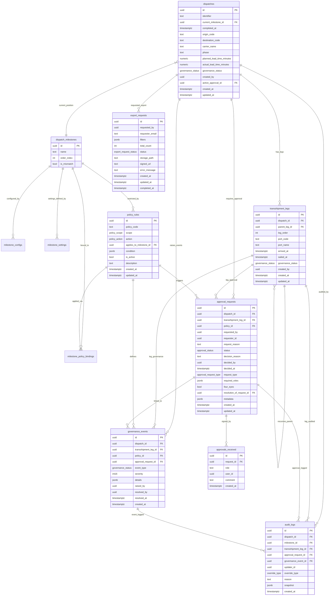

# GLOE: International Freight Forwarding SaaS - Database Schema (ERD)

This document serves as the Single Source of Truth (SSoT) for the GLOE database architecture, as mandated by the V116.0 "ERD Pre-Cognition" Protocol.

## Entity Relationship Diagram

## Architectural Notes

1. **State Machine Integrity**: The `dispatches` table and `dispatch_milestones` drive the 28-step core. Sequential transitions are enforced via the `trg_validate_dispatch` trigger.
2. **Recursive Transshipment**: The `transshipment_legs` table uses a `parent_leg_id` self-reference to allow N-legs of transit ports, anchoring back to the main `dispatch`.
3. **Governance & Four-Eyes**: Approvals require multi-role sign-off and prohibit self-approval through the `validate_approval_receipt` and `all_roles_signed` functions.
4. **Mismatch Detection**: The system automatically triggers `resolution` requests if a `milestone_id` is flagged with `is_mismatch = true`.
5. **Polyglot Strategy**: Primary transactional data resides in PostgreSQL (Supabase), with audit trails and snapshots providing a forensic history for all state mutations.
